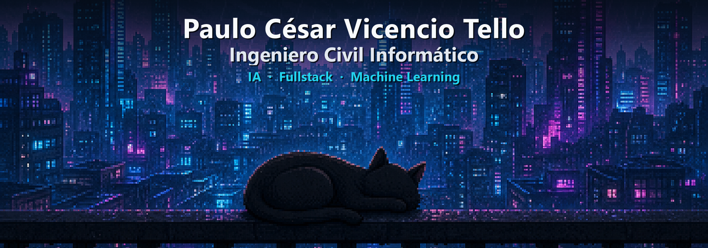
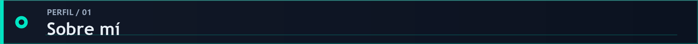
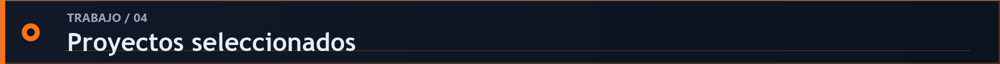
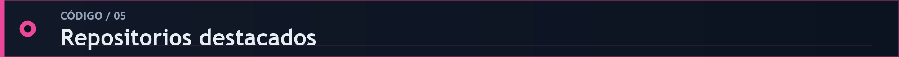
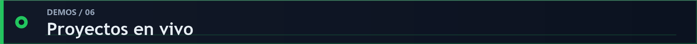
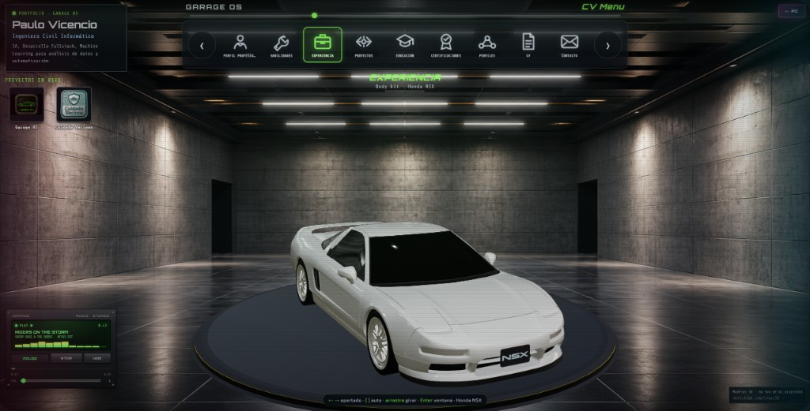
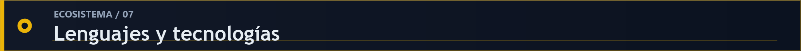
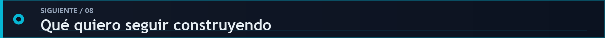

<!--
  GitHub Profile README — Paulo Vicencio (Pillaulo)
  Tema: aurora cian / deep tech — dinámico, animado, profesional con wow
  Repo destino: https://github.com/Pillaulo/Pillaulo
-->

  <!-- Banner cyberpunk pixel art + presentación -->
  

   

  

    
    
    
    
  

---

> **Me gusta tomar una idea, investigarla, construir un prototipo y llevarla hasta algo que otra persona realmente pueda probar.**

Soy **Ingeniero Civil Informático** de Valparaíso, Chile. Me mueve la curiosidad: disfruto explorar tecnologías, comparar caminos posibles y aprender mientras construyo. Trabajo de forma iterativa, cuidando tanto la ingeniería como la experiencia visual.

Mi perfil combina **desarrollo fullstack, inteligencia artificial y Machine Learning**. No busco encasillarme en una sola herramienta; me interesa entender el problema, elegir una solución efectiva y convertirla en un producto útil, escalable y memorable.

  
  
  

---

| 01 · Investigar | 02 · Prototipar | 03 · Validar | 04 · Escalar |
|:---:|:---:|:---:|:---:|
| Entender el problema y explorar alternativas | Hacer tangible la idea rápidamente | Iterar con evidencia y resultados reales | Convertir lo aprendido en una solución sólida |

---

### Lenguajes

### Frontend

### Backend & Data

### AI / ML / Tools

  
  
  
  
  
  
  
  

---

<b>01 / Cuidado Vecinos — Inteligencia Territorial</b> · Fullstack · GIS · Real-time

 

Plataforma georreferenciada con mapas interactivos, heatmaps y reportes anónimos. Stack: **Leaflet**, **OpenStreetMap**, **Supabase** (Auth + PostgreSQL + RLS). Pensada para apoyar decisiones municipales con datos espaciales en vivo.

  
  

<b>02 / Tesis ML — Trayectorias Académicas</b> · Machine Learning · SHAP

 

Modelos de clasificación sobre datos longitudinales de rendimiento escolar para predecir macro-áreas formativas. Evaluación con **F1-score** e interpretabilidad con **SHAP** (asociaciones estadísticas, no determinismo ingenuo).

<b>03 / Predicción de Resistencia del Concreto</b> · Deep Learning

 

Redes neuronales con **TensorFlow/Keras** para estimar resistencia a partir de variables fisicoquímicas. EDA, selección de features y tuning sistemático de hiperparámetros.

<b>04 / Automatización académica con IA (n8n)</b> · UNAB

 

Flujos que generan y publican contenido adaptado a LinkedIn/Instagram, eligen red social con IA y guardan historial en base de datos. Menos trabajo manual, más consistencia.

<b>05 / CS:GO Player Analytics</b> · Clustering · Outliers

 

Modelos supervisados + **K-Means** para segmentar estilos de juego y detectar outliers de rendimiento competitivo.

---

<table>
  <tr>
    <td width="50%" valign="top">
      <h3>01 / <a href="https://github.com/Pillaulo/Portafolio">Garage OS</a></h3>
      
Portafolio 3D interactivo inspirado en la interfaz de un videojuego. Una experiencia visual para recorrer mi perfil, habilidades y proyectos.

      

        
        
      

    </td>
    <td width="50%" valign="top">
      <h3>02 / <a href="https://github.com/Pillaulo/Crimen_MVP">Cuidado Vecinos</a></h3>
      
Plataforma territorial para reportar y visualizar incidentes mediante mapas, heatmaps y datos georreferenciados.

      

        
        
      

    </td>
  </tr>
  <tr>
    <td width="50%" valign="top">
      <h3>03 / <a href="https://github.com/Pillaulo/Proyectitos">Proyectitos</a></h3>
      
Colección de soluciones pequeñas, experimentos y herramientas creadas para resolver necesidades concretas.

      
    </td>
    <td width="50%" valign="top">
      <h3>04 / <a href="https://github.com/Pillaulo/Coursera">Laboratorio de aprendizaje</a></h3>
      
Notebooks, ejercicios y pruebas que documentan mi aprendizaje continuo en datos, programación y Machine Learning.

      
    </td>
  </tr>
</table>

---

> Lo mejor de un proyecto es poder tocarlo. Aquí puedes probarlo tú mismo:

### 01 / Cuidado Vecinos · Seguridad Ciudadana

  

  

### 02 / Garage OS · `TypeScript`

  

---

  
<b>PRODUCTO WEB</b>

  
  
  
  

  
<b>DATOS E INTELIGENCIA ARTIFICIAL</b>

  
  
  
  

  
<b>BACKEND Y FUNDAMENTOS</b>

  
  
  

Una vista del ecosistema con el que construyo; no es un ranking ni depende de la frecuencia de commits.

---

- **01 — Automatizaciones** que simplifiquen procesos y reduzcan trabajo manual.
- **02 — Modelos de Machine Learning** aplicados a problemas reales y medibles.
- **03 — Prototipos** que permitan explorar, validar y comunicar ideas rápidamente.
- **04 — Productos fullstack escalables**, potenciados por IA cuando realmente aporte valor.

Estoy abierto a oportunidades en distintas áreas tecnológicas. Más que perseguir una etiqueta, busco desafíos donde pueda **investigar, aprender y convertir ideas en soluciones reales**.

---

### ¿Construimos algo que se note?

&nbsp;

  

